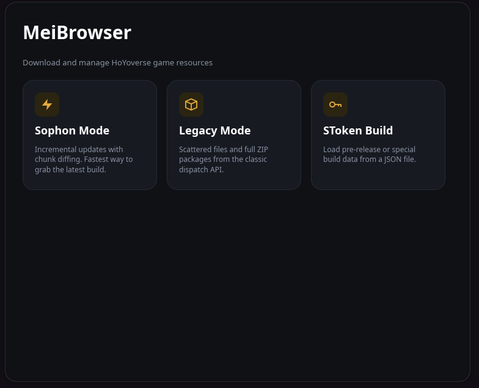
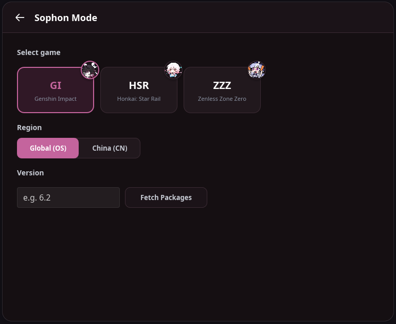
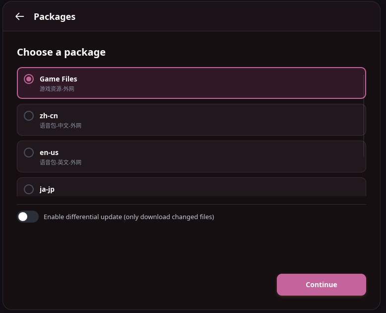
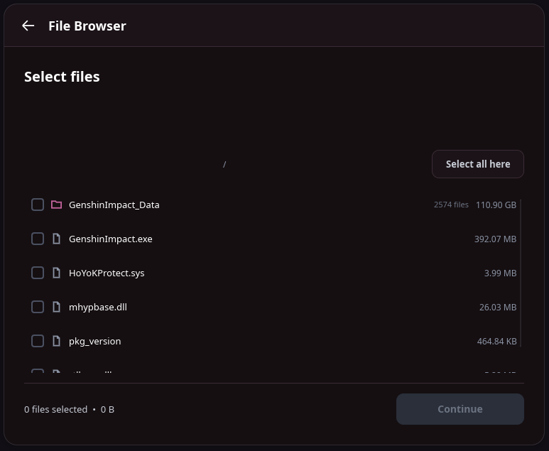
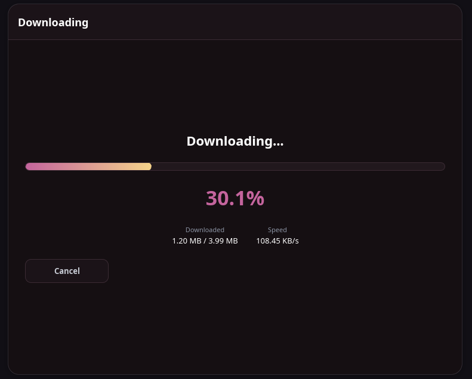
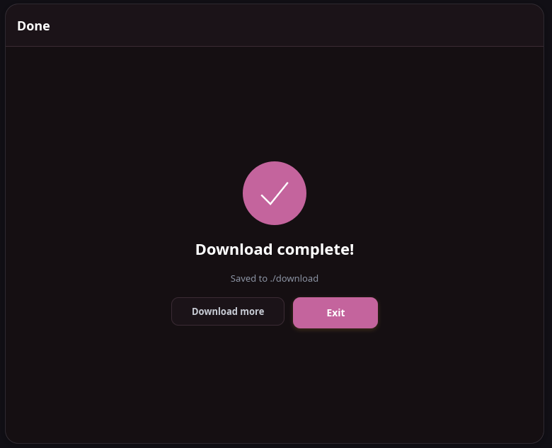

# MeiBrowser-rs

Rust tool for downloading and handling game resources for miHoYo/HoYoverse games. Ships as both a CLI and a desktop GUI, cross-platform.

P.S. - This is a rewrite of the original C# [tool](https://github.com/Escartem/MeiBrowser) to make it cross-platform, not windows specific, make sure to star his repo.

## Features

* **Sophon Mode**: Incremental updates with diffing on chunks

* **Legacy Mode**: Scattered files, as well as download of ZIP packages

* **Differential Updates**: Compute and download only those files which have been modified from one version to another.

* **Multi-Game Support**: Genshin Impact, Honkai: Star Rail, Zenless Zone Zero

* **Multi-Region**: Worldwide (OS) and China (CN) regions supported

* **SToken Builds**: Loads pre-release and special build data

* **Selective Downloads**: Interactive file browser to choose specific assets

* **GUI**: Full desktop interface alongside the CLI


## Screenshots

| | |
|---|---|
|  |  |
|  |  |
|  |  |

## Building

Requires Rust 1.91+

```bash
git clone https://github.com/Yoshk4e/MeiBrowser-rs.git

cd MeiBrowser-rs

cargo build --release
```

This builds both binaries:

* CLI: `target/release/mei-browser`
* GUI: `target/release/mei-browser-gui`

To build just one of them:

```bash
cargo build --release --bin mei-browser       # CLI only
cargo build --release --bin mei-browser-gui   # GUI only
```

## GUI Usage

```bash
./mei-browser-gui
```

## CLI Usage

```bash
./mei-browser
```

### Main Menu Options

1. **Sophon Mode**: Incremental updates

2. **Scattered Files Mode**, Legacy full downloads

3. **Load SToken Build** - Custom/pre-release builds

4. **Exit**

### Example Workflow

#### Download Latest Game Files

```text
1. Sophon Mode

Choose game: 1) Genshin Impact
Choose region: 1) Global (OS)
Version number: 6.2
Choose package: 1) Game Files
Enable diff comparison? (y/N): N
Download all files? (y/N): Y
Enter save path: ./download
```

#### Calculate Update Between Versions

```text
1) Sophon Mode
Choose game: 1) Genshin Impact
Version:6.2
Choose package:
1) Game Files
Enable diff comparison? (y/N): Y
Previous version entry: 5.8
# Diff stats: number of deleted, new, changed files
Continue to download? (y/N): Y
```

#### Load SToken build

```text
3) Load SToken Build
Enter path to SToken JSON file: ./getBuildWithStoken.json
Package details: 1) Game files
```

## License

MIT License - See LICENSE file for details.
